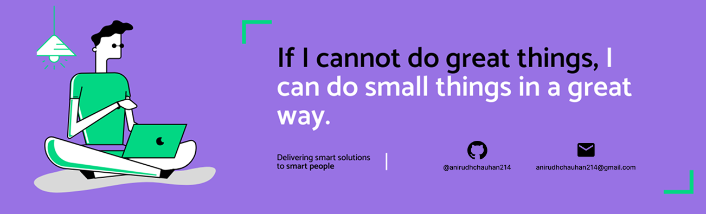

<h1 align="center">Hello  I'm Anirudh Chauhan</h1>

  

 

## 👨🏻‍💻 About Me:

- 🙋‍♂️ All about me is at **[My Portfolio Website](https://your-website-link.com/)**
- 🔭 I’m currently working on `Full-Stack Projects`
- 🌱 I’m currently learning `Backend Development (Nest.js, Python)`
- 👯 I’m looking to collaborate on `Open Source & Dev Projects`
- 🤔 I’m exploring `System Design & Scalable Architectures`
- 💬 Ask me about `React, Next.js, Node.js, Nest.js`
- 👨‍💻 Life Hack: *Consistency > Motivation*
- ⚡ Fun fact: I drink coffee like it’s part of my codebase ☕

---

## 🛠️ Technologies and Tools I use:

---

## ❤️ Let's Connect:

---

## 📊 GitHub Stats:

  
  

